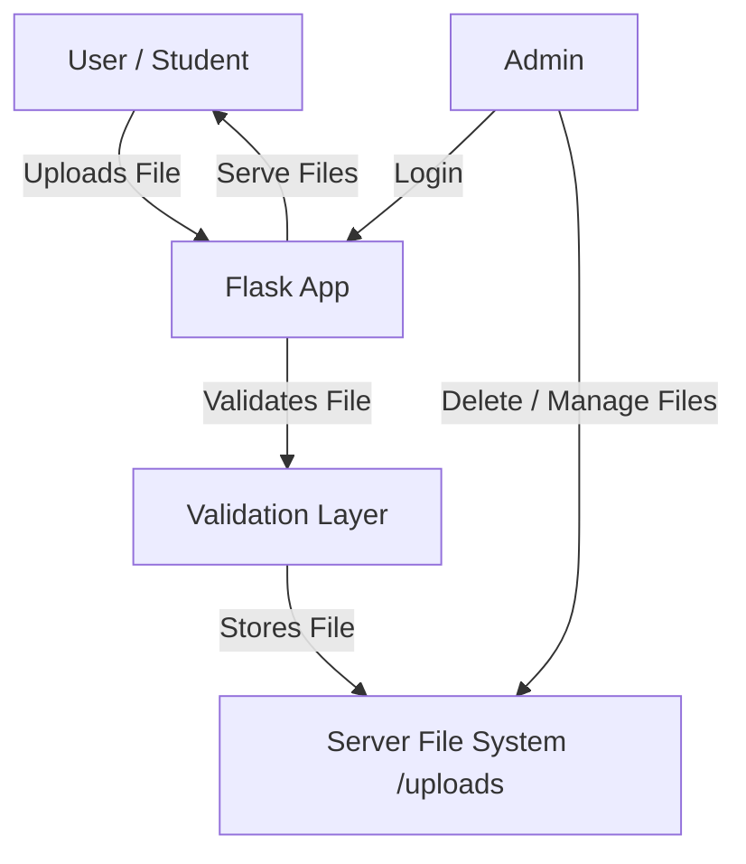

# 📚 StudyDrive

A lightweight, secure **study material sharing platform** built with Flask that allows students to upload files and admins to manage them — without using any database.

> Think of StudyDrive as a **private Google Drive for college notes**, optimized for simplicity and control.

---

## 🚀 Features

* 📤 Upload study materials (PDFs, docs, etc.)
* 🔐 Admin-only authentication using environment variables
* 🗂 Files stored directly on the **server file system**
* ❌ Admin can delete incorrect or unwanted uploads
* 🛡 Secure file handling (size limits, safe filenames)
* 🧠 No database — minimal, fast, and easy to deploy

---

## 🛠 Tech Stack

| Layer    | Technology                      |
| -------- | ------------------------------- |
| Backend  | Flask (Python)                  |
| Frontend | HTML, CSS, JavaScript           |
| Auth     | Session-based authentication    |
| Storage  | Server file system (`/uploads`) |
| Config   | Environment variables           |

---

## 🧩 System Architecture



---

## 🔄 How It Works

### 👤 User Flow

1. User opens StudyDrive
2. Uploads a study file
3. File is validated (type & size)
4. File is stored in `/uploads` directory
5. File becomes available for viewing/downloading

### 🔑 Admin Flow

1. Admin logs in using password (from environment variable)
2. Session is created
3. Admin can view all uploaded files
4. Admin can delete incorrect or unwanted files

---

## 📂 File Storage Explained

All uploaded files are stored in:

```
/uploads
```

* During development → stored on **local machine**
* After deployment → stored on **hosting server’s disk**

❌ Not stored in browser memory
❌ Not stored in database
❌ Not stored in cloud (yet)

---

## 🔐 Security Measures

* `secure_filename()` to prevent path traversal
* File size limits using `MAX_CONTENT_LENGTH`
* Admin password stored in **environment variable**
* Protected admin routes using decorators

---

## ⚙️ Environment Variables

Create a `.env` file (not pushed to GitHub):

```env
ADMIN_PASSWORD=your_secure_password
SECRET_KEY=your_secret_key
```

---

## ▶️ Run Locally

```bash
git clone https://github.com/your-username/studydrive.git
cd studydrive
pip install -r requirements.txt
python app.py
```

---

## 🧠 Design Decisions

* **No database** → simpler architecture, faster development
* **File-system storage** → direct control over files
* **Admin-only moderation** → prevents misuse

---

## 🔮 Future Improvements

* ☁️ Cloud storage (AWS S3 / Firebase)
* 📊 Upload analytics
* 🧹 Auto-cleanup of old files
* 👥 User roles & quotas
* 🔍 File categorization and search

---

## 🧑‍💻 Author

**Kartik Kamat**
Built as a practical backend-focused project using Flask.

---

⭐ If you like this project, consider giving it a star!
